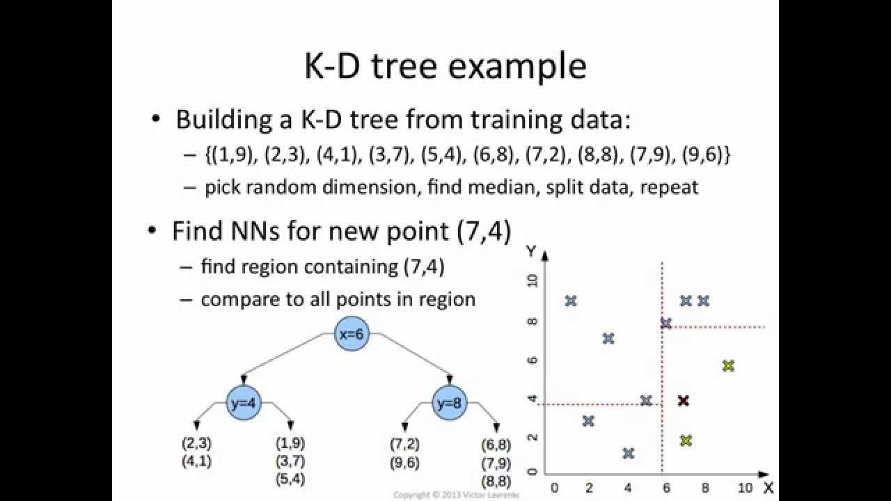

# Flyt Deconfliction

## Project Overview
Flyt Deconfliction is a Python-based toolkit for detecting and resolving 4D (space + time) conflicts between drone flight paths. It provides efficient algorithms for conflict detection, automated resolution suggestions, and interactive 3D visualizations to help ensure safe drone operations in shared airspace.

## Features
- **Efficient Conflict Detection**: Identifies potential conflicts between a primary drone and multiple others using optimized spatial indexing.
- **Automated Resolution Suggestions**: Proposes altitude adjustments to resolve detected conflicts.
- **Interactive 3D Visualization**: Visualizes drone paths and conflicts using Plotly.
- **Extensible Architecture**: Modular codebase for easy integration and extension.

## Time Complexity Improvements

### Conflict Detection Algorithms
| Algorithm | Time Complexity | Description |
|-----------|----------------|-------------|
| **Naive Approach** | O(m × n × k) | For each primary point (m), checks all points (k) of all other drones (n) |
| **KD-Tree Optimized** | O(m × (log N + r)) | Uses spatial indexing (N = n × k) to restrict checks to neighbors (r) |

### Resolution Suggestion Algorithms
| Algorithm | Time Complexity | Description |
|-----------|----------------|-------------|
| **Naive Resolution** | O(w × c) | For each waypoint (w), checks all conflicts (c) |
| **Optimized Resolution** | O(w × (log c + r')) | Uses KD-Tree for conflict locations, spatial neighbors only (r') |



### Performance Impact
- **Scalability**: Optimized algorithms scale logarithmically vs. linearly with drone count
- **Real-time Capability**: Enables sub-second conflict detection for 100+ drones
- **Memory Efficiency**: Spatial indexing reduces memory access patterns

## Installation

### Prerequisites
- Python 3.7+
- Git

### Setup
1. **Clone the repository:**
   ```bash
   git clone <repo-url>
   cd flyt_deconfliction
   ```

2. **Create virtual environment:**
   ```bash
   python -m venv venv
   source venv/bin/activate  # On Windows: venv\Scripts\activate
   ```

3. **Install dependencies:**
   ```bash
   pip install -r requirements.txt
   ```

### Dependencies (requirements.txt)
```txt
plotly>=5.0.0
scipy>=1.7.0
numpy>=1.21.0
fastapi>=0.68.0
uvicorn>=0.15.0
pydantic>=1.8.0
python-multipart>=0.0.5
```

## Usage
### Run Interactive Demo
```bash
python interactive_main.py
```

## Folder Structure
```
flyt_deconfliction/
├── conflict_checker.py      # Core algorithms (optimized & naive)
├── interactive_visualizer.py # 3D visualization with Plotly
├── mission_loader.py        # Mission data loading utilities
├── utils.py                 # Helper functions (distance, interpolation)
├── interactive_main.py      # Demo script
├── sample_data/            # Example mission files
├── test/                   # Unit and integration tests
├── api/                    # FastAPI implementation (future)
└── deployment/             # Docker, K8s configs (future)
```

